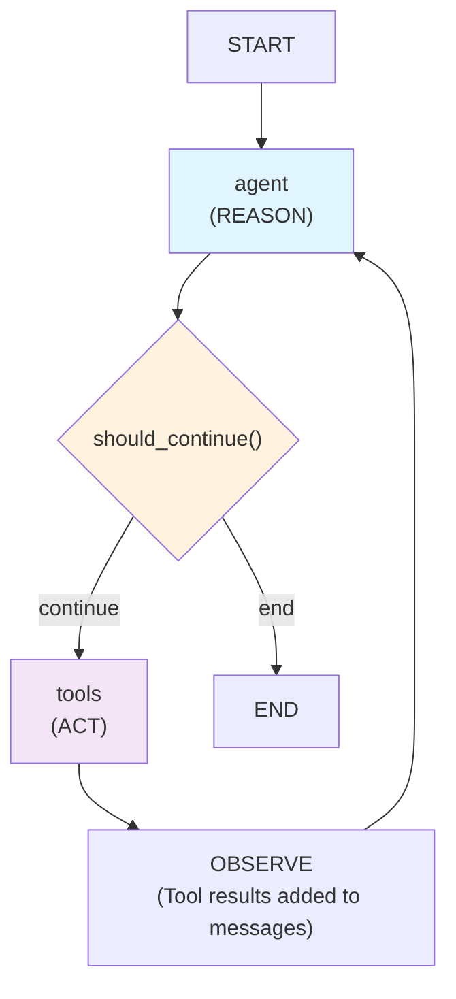

# WSC Workshop

LangGraph workshop exercises for learning agent development patterns.

## Exercise 1: Simple Weather Agent
A basic weather agent that demonstrates linear LangGraph workflows:
- **Pattern**: Linear workflow (START → weather → format → END)
- **Nodes**: 2 nodes (weather data fetching, response formatting)
- **State**: Simple message-based state management
- **Tools**: Tavily search for weather data
- **Model**: OpenAI GPT-4o-mini for response formatting

Students learn fundamental concepts:
- State management with typed dictionaries
- Node functions and workflow construction
- External API integration
- Basic LangGraph patterns

## Exercise 2: REACT Weather Agent
An advanced weather agent implementing the REACT (Reason, Act, Observe) pattern:
- **Pattern**: Iterative decision-making workflow with conditional edges
- **Nodes**: 2 main nodes (`call_model`, `tool_node`) that cycle dynamically
- **State**: Message-based state with LangGraph reducers
- **Tools**: Multiple tools for weather and general search
- **Model**: OpenAI GPT-4o-mini for reasoning and tool orchestration

*Based on the official [LangGraph ReAct agent tutorial](https://langchain-ai.github.io/langgraph/how-tos/react-agent-from-scratch/)*

### How REACT Works:
1. **REASON** (`call_model` node): Model analyzes conversation and decides next action
2. **ACT** (`tool_node`): If tools needed, executes weather/search functions  
3. **OBSERVE**: Tool results added to conversation history
4. **Repeat**: Model re-evaluates with new information until satisfied

### REACT Cycle:


**Key Features:**
- **Dynamic tool selection**: Agent decides which tools to use
- **Multi-step reasoning**: Can make multiple tool calls before responding
- **Conditional flow**: Uses `should_continue()` to route between reasoning and action
- **Self-terminating**: Agent decides when it has enough information

### Test Examples (Multiple Reasoning):
```
Compare weather in Zagreb and Split today
What's the weather in Paris and should I bring an umbrella?
Tell me about weather in Barcelona and Madrid, which city is warmer?
I'm planning a weekend trip to Rome and Vienna, which city has better weather?
Weather in London, Paris, and Berlin - which city is best for outdoor photography today?
Is it good weather for hiking in Swiss Alps and what should I pack?
```

These examples demonstrate REACT pattern where the agent makes **multiple tool calls** and **reasons through each step** before providing a comprehensive answer.

## Setup
1. Install dependencies: `pip install -r requirements.txt`
2. Create `.env` file with API keys:
   ```
   OPENAI_API_KEY=your_key_here
   TAVILY_API_KEY=your_key_here
   ```
3. Run exercises: `python run.py` in each exercise directory