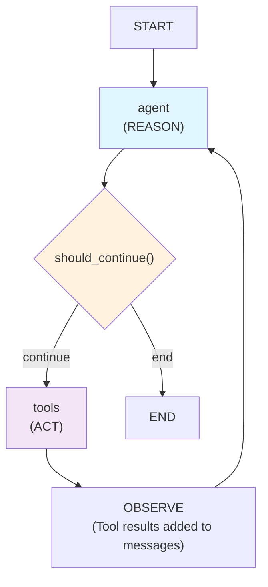
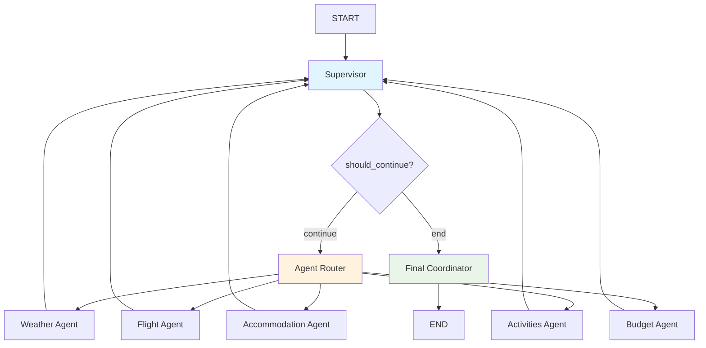

# WSC Workshop

LangGraph workshop exercises for learning agent development patterns.

## Exercise 1: Simple Weather Agent
A basic weather agent that demonstrates linear LangGraph workflows:
- **Pattern**: Linear workflow (START → weather → format → END)
- **Nodes**: 2 nodes (weather data fetching, response formatting)
- **State**: Simple message-based state management
- **Tools**: Tavily search for weather data
- **Model**: OpenAI gpt-4.1-mini for response formatting

Students learn fundamental concepts:
- State management with typed dictionaries
- Node functions and workflow construction
- External API integration
- Basic LangGraph patterns

## Exercise 2: REACT Weather Agent
An advanced weather agent implementing the REACT (Reason, Act, Observe) pattern:
- **Pattern**: Iterative decision-making workflow with conditional edges
- **Nodes**: 2 main nodes (`call_model`, `tool_node`) that cycle dynamically
- **State**: Message-based state with LangGraph reducers
- **Tools**: Multiple tools for weather and general search
- **Model**: OpenAI gpt-4.1-mini for reasoning and tool orchestration

*Based on the official [LangGraph ReAct agent tutorial](https://langchain-ai.github.io/langgraph/how-tos/react-agent-from-scratch/)*

### How REACT Works:
1. **REASON** (`call_model` node): Model analyzes conversation and decides next action
2. **ACT** (`tool_node`): If tools needed, executes weather/search functions  
3. **OBSERVE**: Tool results added to conversation history
4. **Repeat**: Model re-evaluates with new information until satisfied

### REACT Cycle:


**Key Features:**
- **Dynamic tool selection**: Agent decides which tools to use
- **Multi-step reasoning**: Can make multiple tool calls before responding
- **Conditional flow**: Uses `should_continue()` to route between reasoning and action
- **Self-terminating**: Agent decides when it has enough information

### Test Examples (Multiple Reasoning):
```
Compare weather in Zagreb and Split today
What's the weather in Paris and should I bring an umbrella?
Tell me about weather in Barcelona and Madrid, which city is warmer?
I'm planning a weekend trip to Rome and Vienna, which city has better weather?
Weather in London, Paris, and Berlin - which city is best for outdoor photography today?
Is it good weather for hiking in Swiss Alps and what should I pack?
```

These examples demonstrate REACT pattern where the agent makes **multiple tool calls** and **reasons through each step** before providing a comprehensive answer.

## Exercise 3: Supervisor Multi-Agent System
A comprehensive travel planning system implementing the Supervisor pattern with specialized agents:
- **Pattern**: Supervisor coordinates multiple specialized agents in sequence
- **Nodes**: 7 nodes (supervisor, 5 specialized agents, final coordinator)
- **State**: Simple message-based state with routing decisions
- **Tools**: 5 specialized Tavily search tools for different travel aspects
- **Model**: OpenAI gpt-4.1-mini for all agent reasoning and coordination

*Based on the [LangGraph Supervisor tutorial](https://langchain-ai.github.io/langgraph/how-tos/supervisor/)*

### How Supervisor Pattern Works:
1. **USER REQUEST**: Travel planning request (e.g., "Plan a weekend trip to Barcelona")
2. **SUPERVISOR**: Analyzes request and routes to appropriate agent
3. **SPECIALIZED AGENTS**: Each agent searches web and provides analysis:
   - 🌤️ **Weather Agent**: Climate, forecast, packing recommendations
   - ✈️ **Flight Agent**: Flight options, prices, booking advice
   - 🏨 **Accommodation Agent**: Hotels, hostels, booking recommendations
   - 🎯 **Activities Agent**: Attractions, restaurants, itineraries
   - 💰 **Budget Agent**: Cost estimates, budget breakdowns, money-saving tips
4. **FINAL COORDINATOR**: Combines all agent responses into comprehensive travel plan

### Supervisor Workflow:


**Key Features:**
- **Intent Recognition**: Supervisor automatically determines which agents to run
- **Sequential Execution**: All 5 agents run one by one for complete coverage
- **No Manual Parsing**: Each agent passes full user query to LLM for processing
- **Comprehensive Results**: Final coordinator creates unified travel plan
- **Clean Architecture**: Simple, modular design with clear separation of concerns

### Test Examples:
```
Plan a weekend trip to Barcelona
Plan a 5-day trip to Paris in March with a $2000 budget
I want to visit Tokyo for cultural experiences
Plan a budget backpacking trip through Europe
Weekend getaway to Rome - good food and museums
```

Each request triggers all 5 specialized agents to provide comprehensive travel planning coverage.

## Setup
1. Install dependencies: `pip install -r requirements.txt`
2. Create `.env` file with API keys:
   ```
   OPENAI_API_KEY=your_key_here
   TAVILY_API_KEY=your_key_here
   ```
3. Run exercises: `python run.py` in each exercise directory

## Navigate Between Exercise Versions

You can use git tags to switch between different states of each exercise:

### Available Tags:
- `exercises-1-end` - Completed Exercise 1
- `exercises-2-start` - Starting point for Exercise 2  
- `exercises-2-end` - Completed Exercise 2
- `exercises-3-start` - Starting point for Exercise 3
- `exercises-3-end` - Completed Exercise 3

### Usage:
```bash
# Go to start of Exercise 2 (empty template)
git checkout exercises-2-start

# Go to completed Exercise 2
git checkout exercises-2-end

# Go to start of Exercise 3 (empty template)  
git checkout exercises-3-start

# Go to completed Exercise 3
git checkout exercises-3-end

# Return to latest version
git checkout main
```

This allows you to:
- Start any exercise from scratch with template code
- Jump to completed solutions for reference
- Compare your implementation with the final version
- Reset if you want to try again